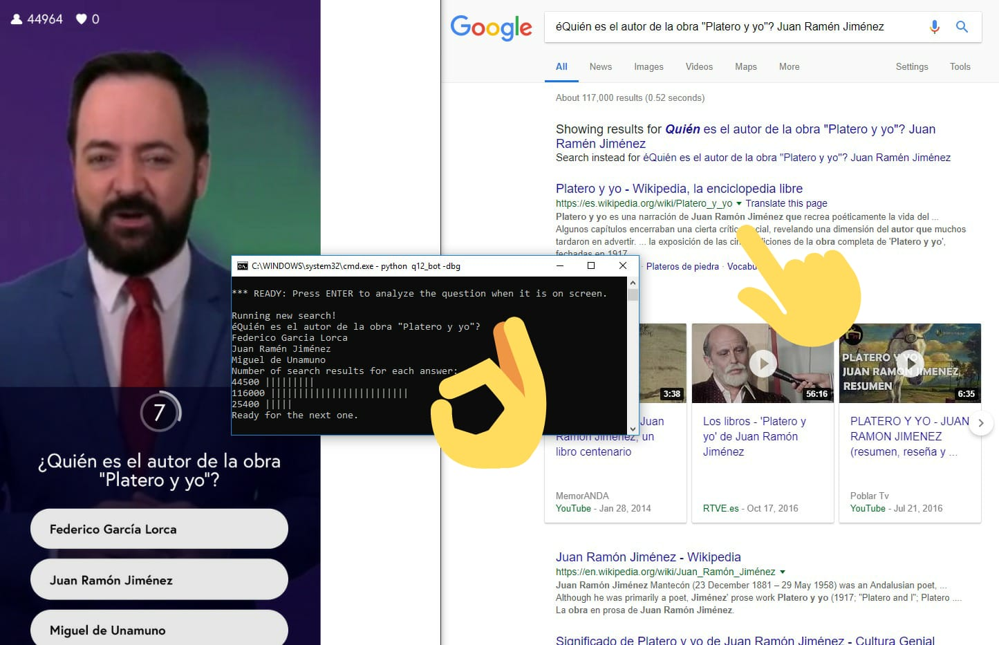

# Q12 Trivia bot :robot:
## A small help for the Q12 Trivia contest. Automatically identifies the questions and guesses the most likely answer.

After all my friends told me to play Q12 I surrendered and played it too.
 
...my way :trollface:

 

This bot uses OCR to identify the question and answer, launches google searches for you to take a look and parses the results to make a basic guess of which is the most likely answer.

 

The <b>result</b> is this:

  

<b>PS:</b> Don't expect for this bot to start playing for you and making money. It's accuracy depends greatly on the wording of the questions, some days it's as high as 83%, other days it's 58%. It's a tiny (~150 lines) prototype that works better than expected.

  

### Requirements
- Python 3
- pytesseract
- cv2

### Run
`python q12_bot` (on the directory above the /q12_bot folder)
